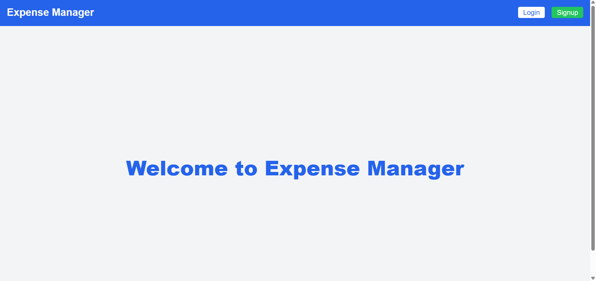
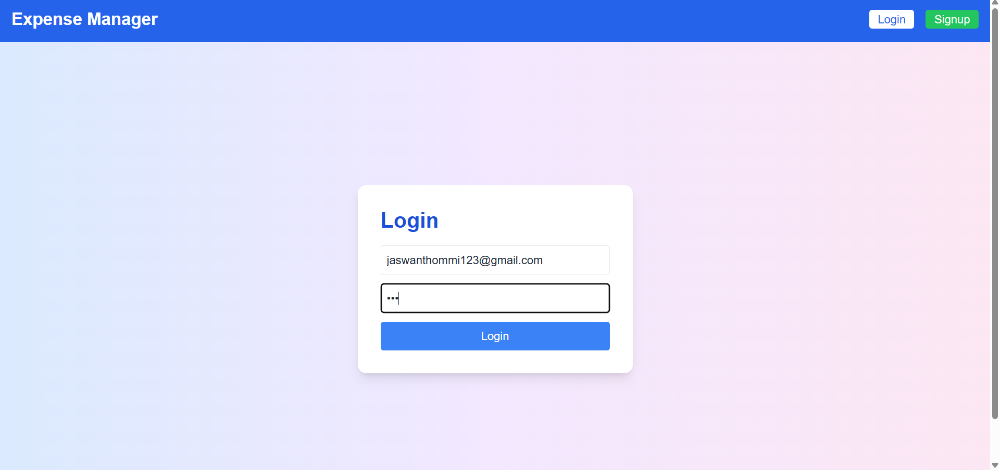
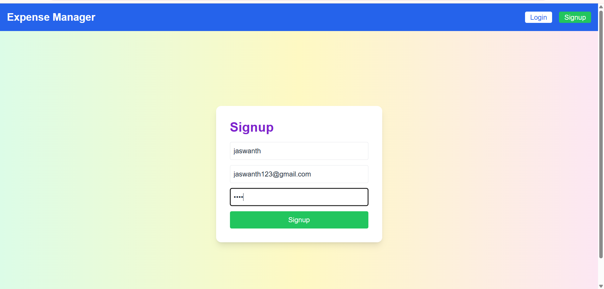
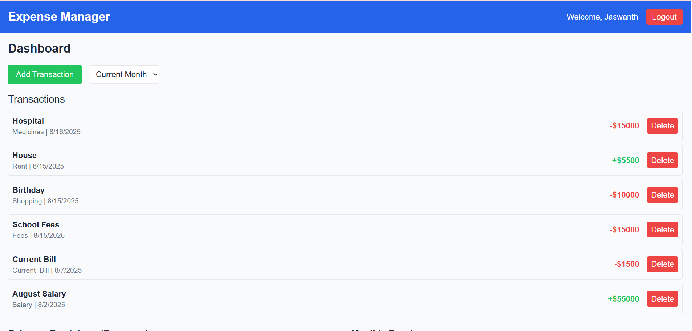
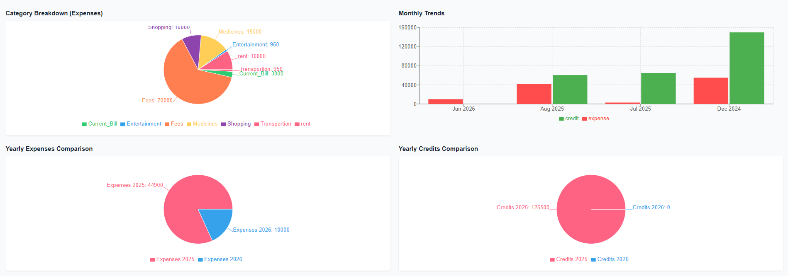

# 费用管理系统 (Expense Management System)

<!-- 项目 Git 地址：<your-github-repo-link> -->

一个基于 MERN 栈开发的全栈费用管理系统，用于个人和企业的日常费用追踪与管理。

## 📋 功能特性

- **用户认证**：基于 JWT 的安全登录与注册
- **费用追踪**：记录和管理日常支出
- **预算管理**：设置月度/年度预算目标
- **费用分类**：灵活的分类管理系统
- **财务报表**：可视化的数据分析与报告
- **交互式仪表盘**：直观的数据展示
- **响应式设计**：支持多种设备访问

## 🏗️ 技术架构

### 前端技术栈
| 技术 | 版本 | 说明 |
|------|------|------|
| React.js | ^18.x | 前端框架 |
| Tailwind CSS | ^3.x | CSS 框架 |
| Axios | ^1.x | HTTP 客户端 |
| Chart.js / Recharts | ^4.x | 图表库 |
| React Context | - | 状态管理 |

### 后端技术栈
| 技术 | 版本 | 说明 |
|------|------|------|
| Node.js | ^20.x | 运行时环境 |
| Express.js | ^4.x | Web 框架 |
| JWT | ^9.x | 身份认证 |
| bcryptjs | ^2.x | 密码加密 |
| Morgan | ^1.x | 日志中间件 |

### 数据库
- **MongoDB**：NoSQL 文档型数据库

## 📁 项目结构

```
Expense-Managment-System-web/
├── client/                    # 前端应用
│   ├── public/                # 静态资源
│   ├── src/
│   │   ├── components/        # 公共组件
│   │   ├── context/           # 状态管理
│   │   ├── pages/             # 页面组件
│   │   ├── utils/             # 工具函数
│   │   ├── App.js             # 主应用组件
│   │   ├── index.css          # 全局样式
│   │   └── index.js           # 入口文件
│   ├── package.json
│   └── tailwind.config.js     # Tailwind 配置
├── server/                    # 后端服务
│   ├── config/                # 配置文件
│   ├── controllers/           # 控制器
│   ├── middleware/            # 中间件
│   ├── models/                # 数据模型
│   ├── routes/                # 路由定义
│   ├── utils/                 # 工具函数
│   ├── package.json
│   └── server.js              # 服务入口
├── README.md
└── .gitignore
```

## 🚀 快速开始

### 环境要求

- Node.js >= 20.x
- MongoDB >= 6.x
- npm >= 10.x

### 安装步骤

**1. 克隆项目**

```bash
git clone <your-github-repo-link>
cd Expense-Managment-System-web
```

**2. 安装后端依赖**

```bash
cd server
npm install
npm install morgan
```

**3. 安装前端依赖**

```bash
cd ../client
npm install
```

### 配置环境变量

在 `server` 目录下创建 `.env` 文件：

```env
# 服务器端口
PORT=5000

# MongoDB 连接地址
MONGO_URI=mongodb://127.0.0.1:27017/expense_management

# JWT 密钥（请设置为安全的随机字符串）
JWT_SECRET=your_secret_key_here
```

### 启动项目

**启动后端服务**

```bash
cd server
npm run dev
```

后端服务将运行在 `http://localhost:5000`

**启动前端开发服务器**

```bash
cd client
npm start
```

前端应用将运行在 `http://localhost:3000`

## 📱 页面预览

### 首页


### 登录页


### 注册页


### 收支管理页


### 总览页


## 📝 API 接口

| 接口 | 方法 | 描述 |
|------|------|------|
| `/api/auth/login` | POST | 用户登录 |
| `/api/auth/signup` | POST | 用户注册 |
| `/api/expenses` | GET/POST | 费用列表/创建 |
| `/api/budgets` | GET/POST | 预算列表/创建 |
| `/api/categories` | GET | 分类列表 |
| `/api/reports` | GET | 报表数据 |

## 📜 许可证

MIT License

## 🤝 贡献

欢迎提交 Issue 和 Pull Request！

## 📧 联系方式

如有问题或建议，请通过以下方式联系：
- 邮箱：your-email@example.com